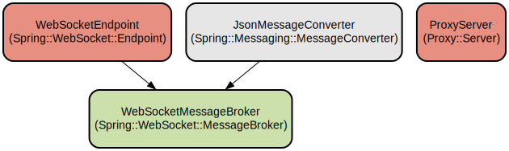

# Spring Boot + Angular WebSocket Demo with Real-time Communication

This project demonstrates real-time bidirectional communication between a Spring Boot backend and an Angular frontend using WebSocket technology. It features automatic reconnection handling, periodic keepalive broadcasts, and a robust message delivery system.

The application showcases WebSocket implementation best practices with STOMP (Streaming Text Oriented Messaging Protocol) over SockJS, providing fallback options for environments where WebSocket connections are not available. The frontend offers a user-friendly interface for sending messages and viewing real-time updates, while the backend handles message routing, periodic broadcasts, and connection management.

It uses Spring Boot 3.4.5 and angular 19 along with a java websocket client.

## Usage Instructions
### Prerequisites
- Java Development Kit (JDK) 24 or later
- Node.js 19.x or later
- npm 22.x or later
- Maven 3.9.9 or later

### Installation

1. Build and run the backend:
```bash
# For Unix-like systems
./mvnw clean install
./mvnw spring-boot:run

# For Windows
mvnw.cmd clean install
mvnw.cmd spring-boot:run
```

2. Install and run the frontend:
```bash
cd fe
npm install
npm start
```

### Quick Start
1. Access the FE at `http://localhost:4200`
2. The WebSocket connection status will be displayed at the top of the page
3. Enter messages in the input field and click "Send" to broadcast them
4. Observe the periodic keepalive broadcasts every 5 seconds
5. You can run the test classes `Main1`, `Main2` and `Main3` which demonstrate both sending and receiving messages and receiving a broadcast message

### More Detailed Examples
1. Sending messages:
```typescript
// Using the WebSocket service
this.websocketService.send('/app/hello', {
  id: 1,
  text: 'Hello, WebSocket!'
});
```

2. Subscribing to topics:
```typescript
this.websocketService.subscribe('/topic/greetings', (message) => {
  console.log('Received:', message);
});
```

### Troubleshooting

1. Connection Issues
- Error: "WebSocket connection failed"
  - Verify the backend is running on port 8080
  - Check if any firewall is blocking WebSocket connections
  - Ensure the proxy configuration is correct in `proxy.json`

2. Message Delivery Problems
- Check the browser console for any STOMP protocol errors
- Verify message format matches `MyWebsocketMessage` structure
- Enable debug logging in `application.yaml`:
```yaml
logging:
  level:
    org.springframework.web.socket: DEBUG
```

## Data Flow
The application implements a bidirectional message flow between clients and server using STOMP over WebSocket, with automatic reconnection handling and periodic keepalive messages.

```ascii
Client                    Server
  |                         |
  |------ Connect -------->| [/ws endpoint]
  |                         |
  |<---- Connected --------| 
  |                         |
  |------ Message -------->| [/app/hello]
  |                         |
  |<----- Broadcast -------| [/topic/greetings]
  |                         |
  |<---- Keepalive --------| [/topic/broadcast]
  |         .              |
  |         .              |
  |         .              |
```

Key component interactions:
1. Client establishes WebSocket connection through SockJS fallback options
2. Server configures message broker for /topic destinations
3. Messages are routed through /app prefix to appropriate handlers
4. PeriodicBroadcastService sends keepalive messages every 5 seconds
5. JSON message conversion is handled automatically
6. Automatic reconnection is implemented on connection loss
7. Cross-origin resource sharing (CORS) is configured for development

## Infrastructure


### Server Configuration
- Jetty server running on port 8080
- Maximum HTTP form post size: 100MB
- Thread pool: min 8, max 200 threads
- Idle timeout: 60 seconds

### WebSocket Configuration
- Maximum message sizes: 65KB for both text and binary
- SockJS heartbeat interval: 25 seconds
- STOMP endpoints: /ws with SockJS fallback
- Message broker: Simple in-memory broker
- Destination prefixes: /app for application endpoints, /topic for subscriptions